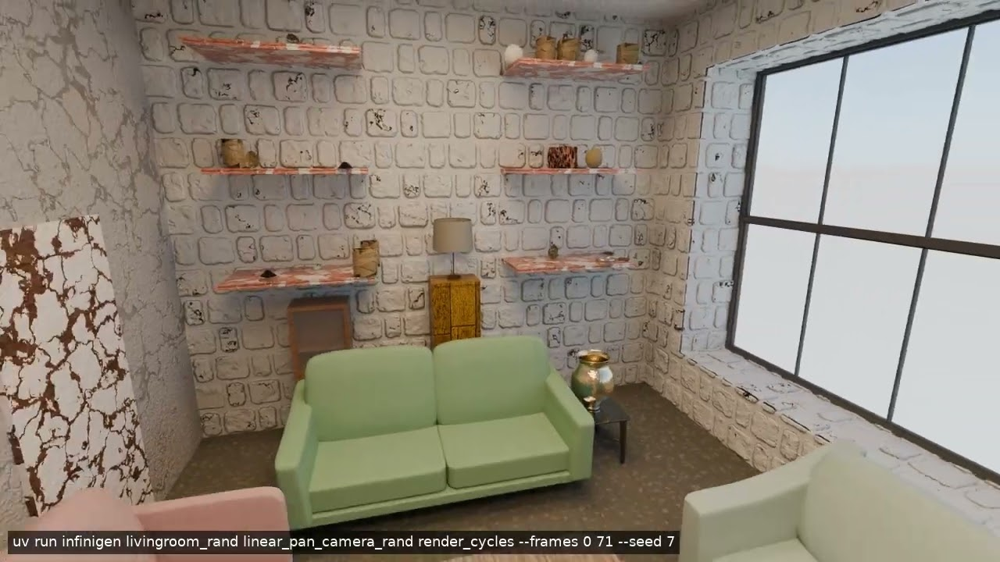
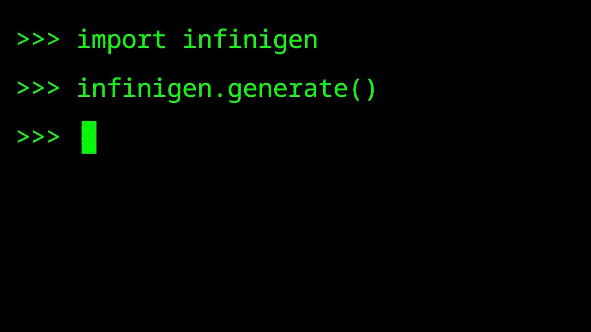

# Alexander Raistrick

I'm a Ph.D student at Princeton University advised by [Jia Deng](https://www.cs.princeton.edu/~jiadeng/).

I work on [Infinigen](https://infinigen.org), a procedural 3D data generator for computer vision and robotics.

I did my undergrad at the University of Michigan, and was fortunate to work with [David Fouhey](https://web.eecs.umich.edu/~fouhey/) and previously [Michael Nebeling](http://michael-nebeling.de/).

[Email](mailto:araistrick@princeton.edu) / [GitHub](https://github.com/araistrick) / [Google Scholar](https://scholar.google.com/citations?user=GYwaBgoAAAAJ&hl=en) / [[Attachments/curriculum_vitae.pdf|CV]] / [Twitter](https://twitter.com/alex_raistrick)

Send me anonymous personal feedback [here](https://docs.google.com/forms/d/e/1FAIpQLSclvXp7rPuOjqX7T2s2AhVf62mVm1KBQG2wI-K_H98MKl55fw/viewform?usp=header)!

## Research

- ### [ProcFunc: Function-Oriented Abstractions for Procedural 3D Generation in Python](https://github.com/princeton-vl/procfunc) **(New!)**

  

   _Alexander Raistrick, Karhan Kayan, Jack Nugent, David Yan, Lingjie Mei, Meenal Parakh, Hongyu Wen, Dylan Li, Yiming Zuo, Erich Liang, Jia Deng_ — Released 2026-04-29, Preprint.

  [github](https://github.com/princeton-vl/procfunc) / [arxiv](https://arxiv.org/abs/2604.26943) / [dataset](https://huggingface.co/datasets/infinigen/2026-08-flying-indoor-preview)

- ### [Infinigen Articulated: Procedural Generation of Articulated Simulation-Ready Assets](https://github.com/princeton-vl/infinigen/blob/main/docs/source/ExportingToSimulators.md)

  ![[Attachments/ca-infinigen-sim.mp4|400]]

   _Abhishek Joshi, Beining Han, Jack Nugent, Max Gonzalez Saez-Diez, Yiming Zuo, Jonathan Liu, Hongyu Wen, Stamatis Alexandropoulos, Karhan Kayan, Anna Calveri, Tao Sun, Gaowen Liu, Yi Shao, Alexander Raistrick, Jia Deng_ — Released 2025-05-15, Preprint.

  [github](https://github.com/princeton-vl/infinigen/blob/main/docs/source/ExportingToSimulators.md) / [arxiv](https://arxiv.org/abs/2505.10755) / [dataset](https://huggingface.co/datasets/princeton-vl/infinigen-articulated)

- ### [Infinigen Indoors: Photorealistic Indoor Scenes using Procedural Generation](https://github.com/princeton-vl/infinigen)

  ![[Attachments/infinigen_indoor.jpeg|400]]

   _Alexander Raistrick\*, Lingjie Mei\*, Karhan Kaan Kayan\* (\*equal contribution), David Yan, Yiming Zuo, Beining Han, Hongyu Wen, Meenal Parakh, Stamatis Alexandropoulos, Lahav Lipson, Zeyu Ma, Jia Deng_ — Released 2024-06-17, Published at **CVPR 2024**.

  [github](https://github.com/princeton-vl/infinigen) / [website](https://infinigen.org/) / [arxiv](https://arxiv.org/abs/2406.11824) / [proceedings](https://openaccess.thecvf.com/content/CVPR2024/html/Raistrick_Infinigen_Indoors_Photorealistic_Indoor_Scenes_using_Procedural_Generation_CVPR_2024_paper.html)

- ### [Infinigen: Infinite Photorealistic Worlds using Procedural Generation](https://github.com/princeton-vl/infinigen)

  

   _Alexander Raistrick, Lahav Lipson, Zeyu Ma, Lingjie Mei, Mingzhe Wang, Yiming Zuo, Karhan Kayan, Hongyu Wen, Beining Han, Yihan Wang, Alejandro Newell, Hei Law, Ankit Goyal, Kaiyu Yang, Jia Deng_ — Released 2023-06-15, Published at **CVPR 2023**.

  [github](https://github.com/princeton-vl/infinigen) / [website](https://infinigen.org/) / [arxiv](https://arxiv.org/abs/2306.09310) / [dataset](https://huggingface.co/datasets/infinigen/2023-10-nature-preview) / [video](https://youtu.be/6tgspeI-GHY) / [proceedings](https://openaccess.thecvf.com/content/CVPR2023/html/Raistrick_Infinite_Photorealistic_Worlds_Using_Procedural_Generation_CVPR_2023_paper.html)

### All Papers

#### ProcFunc: Function-Oriented Abstractions for Procedural 3D Generation in Python

 _Alexander Raistrick, Karhan Kayan, Jack Nugent, David Yan, Lingjie Mei, Meenal Parakh, Hongyu Wen, Dylan Li, Yiming Zuo, Erich Liang, Jia Deng_ — Released 2026-04-29, Preprint.

[github](https://github.com/princeton-vl/procfunc) / [arxiv](https://arxiv.org/abs/2604.26943) / [dataset](https://huggingface.co/datasets/infinigen/2026-08-flying-indoor-preview)

#### SimpleProc: Fully Procedural Synthetic Data from Simple Rules for Multi-View Stereo

 _Zeyu Ma, Alexander Raistrick, Jia Deng_ — Released 2026-04-06, Preprint.

[github](https://github.com/princeton-vl/SimpleProc) / [arxiv](https://arxiv.org/abs/2604.04925) / [dataset](https://huggingface.co/datasets/princeton-vl/SimpleProc)

#### WMGStereo: What Makes Good Synthetic Training Data for Zero-Shot Stereo Matching?

 _David Yan, Alexander Raistrick, Jia Deng_ — Released 2025-04-23, Published at **CVPR 2026**.

[github](https://github.com/princeton-vl/InfinigenStereo) / [arxiv](https://arxiv.org/abs/2504.16930) / [dataset](https://huggingface.co/datasets/princeton-vl/WMGStereo)

#### Evaluating Robustness of Monocular Depth Estimation with Procedural Scene Perturbations

 _Jack Nugent, Siyang Wu, Zeyu Ma, Beining Han, Meenal Parakh, Abhishek Joshi, Lingjie Mei, Alexander Raistrick, Xinyuan Li, Jia Deng_ — Released 2025-07-01, Published at **NeurIPS 2025**.

[github](https://github.com/princeton-vl/proc-depth-eval) / [arxiv](https://arxiv.org/abs/2507.00981) / [proceedings](https://neurips.cc/virtual/2025/poster/117944)

#### Infinigen Articulated: Procedural Generation of Articulated Simulation-Ready Assets

 _Abhishek Joshi, Beining Han, Jack Nugent, Max Gonzalez Saez-Diez, Yiming Zuo, Jonathan Liu, Hongyu Wen, Stamatis Alexandropoulos, Karhan Kayan, Anna Calveri, Tao Sun, Gaowen Liu, Yi Shao, Alexander Raistrick, Jia Deng_ — Released 2025-05-15, Preprint.

[github](https://github.com/princeton-vl/infinigen/blob/main/docs/source/ExportingToSimulators.md) / [arxiv](https://arxiv.org/abs/2505.10755) / [dataset](https://huggingface.co/datasets/princeton-vl/infinigen-articulated)

#### View-Dependent Octree-based Mesh Extraction in Unbounded Scenes for Procedural Synthetic Data

 _Zeyu Ma, Alexander Raistrick, Lahav Lipson, Jia Deng_ — Released 2023-12-13, Published at **3DV 2025**.

[github](https://github.com/princeton-vl/OcMesher) / [arxiv](https://arxiv.org/abs/2312.08364) / [proceedings](https://www.computer.org/csdl/proceedings-article/3dv/2025/385100a845/29t3rzRODrW)

#### Infinigen Indoors: Photorealistic Indoor Scenes using Procedural Generation

 _Alexander Raistrick\*, Lingjie Mei\*, Karhan Kaan Kayan\* (\*equal contribution), David Yan, Yiming Zuo, Beining Han, Hongyu Wen, Meenal Parakh, Stamatis Alexandropoulos, Lahav Lipson, Zeyu Ma, Jia Deng_ — Released 2024-06-17, Published at **CVPR 2024**.

[github](https://github.com/princeton-vl/infinigen) / [website](https://infinigen.org/) / [arxiv](https://arxiv.org/abs/2406.11824) / [proceedings](https://openaccess.thecvf.com/content/CVPR2024/html/Raistrick_Infinigen_Indoors_Photorealistic_Indoor_Scenes_using_Procedural_Generation_CVPR_2024_paper.html)

#### Infinigen: Infinite Photorealistic Worlds using Procedural Generation

 _Alexander Raistrick\*, Lahav Lipson\*, Zeyu Ma\* (\*equal contribution, alphabetical order), Lingjie Mei, Mingzhe Wang, Yiming Zuo, Karhan Kayan, Hongyu Wen, Beining Han, Yihan Wang, Alejandro Newell, Hei Law, Ankit Goyal, Kaiyu Yang, Jia Deng_ — Released 2023-06-15, Published at **CVPR 2023**.

[github](https://github.com/princeton-vl/infinigen) / [website](https://infinigen.org/) / [arxiv](https://arxiv.org/abs/2306.09310) / [dataset](https://huggingface.co/datasets/infinigen/2023-10-nature-preview) / [video](https://youtu.be/6tgspeI-GHY) / [proceedings](https://openaccess.thecvf.com/content/CVPR2023/html/Raistrick_Infinite_Photorealistic_Worlds_Using_Procedural_Generation_CVPR_2023_paper.html)

#### Collision Replay: What Does Bumping Into Things Tell You About Scene Geometry?

 _Alexander Raistrick, Nilesh Kulkarni and David F. Fouhey_ — Released 2021-05-03, Published at **BMVC 2021** (**Oral**).

[website](https://araistrick.github.io/collisionreplay) / [arxiv](https://arxiv.org/abs/2105.01061) / [proceedings](https://bmva-archive.org.uk/bmvc/2021/conference/papers/paper_0762.html)

#### MRAT: The Mixed Reality Analytics Toolkit

 _M. Nebeling, M. Speicher, X. Wang, S. Rajaram, B.D. Hall, Z. Xie, A.R.E. Raistrick, M. Aebersold, E.G. Happ, J. Wang, Y. Sun, L. Zhang, L. Ramsier, R. Kulkarni_ — Released 2020-04-21, Published at **CHI 2020** (**Best Paper**).

[github](https://github.com/mi2lab/mrat) / [website](https://www.mi2lab.com/research/mrat/) / [video](https://www.youtube.com/watch?v=DG5pqrQPdBc) / [paper](http://michael-nebeling.de/publications/chi20b.pdf) / [proceedings](https://dl.acm.org/doi/10.1145/3313831.3376330)
